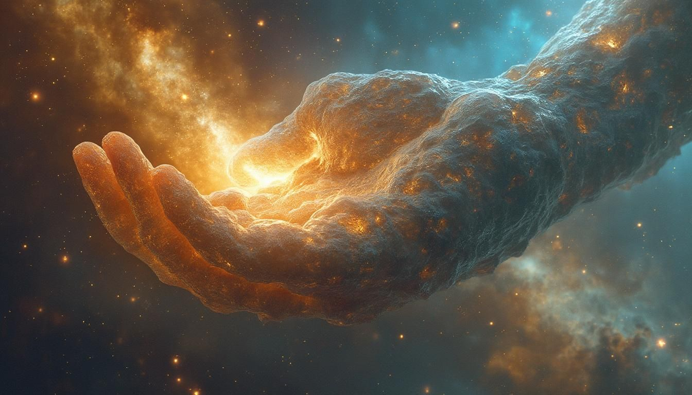

# Project Demiurg



**Project Demiurg** - a generative system representing a semantic engine for creating internally coherent fictional realities, utilizing world synthesis based on text queries (prompts) and LLMs according to the SRGC representation model.

## Overview

**DEMI** (the **Project Demiurg Engine** tool) is a tool that transforms text queries into **self-contained fictional realities**, structured according to the **SRGC representation model**. Using a multi-agent system based on local **Large Language Models (LLMs)** via [Ollama](https://ollama.com/), it generates semantic [JSON](https://www.json.org) structures that do not just describe but form the foundation for the existence and evolution of complex worlds in accordance with their own internal logic, adhering to **SRGC** principles.

Whether you are creating a simulation, a narrative universe, or an abstract conceptual model, DEMI provides a fundamental structure rooted in pure semantic meaning.

---

## Key Concepts

To fully understand DEMI, it is crucial to distinguish between the engine itself and the unique model of reality it uses and generates.

### Project Demiurg Engine
**DEMI (Project Demiurg Engine)** is a **generative system, an engine, and a tool** that **performs the process of generating, unfolding (manifesting), and querying** worlds. It accepts user prompts and, using LLMs, creates or modifies world structures. DEMI is the **mechanism** that allows you to interact with reality.

### SRGC Representation Model
**SRGC (Semantic Reality with Gradient Concretization)** is a conceptual model of semantic reality with gradient concretization. It is a **unique conceptual model, a metaphysical structure, or the "nature" of reality itself** that DEMI generates and interacts with. Unlike traditional, static ontologies, SRGC describes a reality where entities exist in a **gradient spectrum of concretization** - from abstract concepts and undifferentiated groups to precisely manifested components.

**Key idea of SRGC:** World details initially exist in a state of **potential and uncertainty**, and they **"materialize" (manifest)** on demand, without violating the world's internal logic. This allows a world to contain, for example, both **concrete, fully manifested entities** and **undefined groups**. SRGC allows reality to be **partially concretized** until the moment of "observation." For instance, "one apple" and "the remaining apples in the basket" can coexist correctly in one SRGC-structure, where "remaining apples" is an entity with the potential for further concretization, not an error.

**World as Synergy:** A world in DEMI is an **emergent reality** that arises from the synergy between a structured map (JSON, created by the SRGC model) and a language model (LLM). The JSON is not the world itself, but its **potential**, containing meanings and rules. The LLM is not just a text generator, but the **engine** that **unveils** this potential. Together, they create a **micro-dimension** - a dynamic, logically coherent system that you can explore using commands like `navigate` and `query`. This is not static text or imagination, but a living informational reality existing in the process of interaction.

---

## Interactive Exploration

For a more intuitive understanding of DEMI's structured outputs, we offer tools for visualizing generated realities.

### Project Website

For a general overview of DEMI and an integrated experience, a dedicated [project website](https://architector1324.github.io/project-demiurg/index.html) is available.

### Local Visualizer

An interactive graph visualizer is available for local use, allowing you to explore the **gradient concretization structure** of DEMI worlds directly on your machine.

*   **Location:** The standalone visualizer is located at [`visualizer/visualizer.html`](./visualizer/visualizer.html) in this repository.
*   **Usage:** Open `visualizer.html` in your web browser. You can paste any generated DEMI JSON output into the text field or load an example to see its internal structure as a dynamic, unfolding graph.

---

## Getting Started

### ChatGPT
If you're curious about DEMI's unique approach to reality generation and how it handles seemingly impossible concepts like infinite detail in a finite file? We've recorded a real conversation with **ChatGPT** that serves as an accessible introduction to DEMI's key ideas, philosophy, and practical applications, **especially in how it generates and allows navigation of realities based on SRGC.**

**The full dialogue is available here:** [DEMI: Explanatory Introduction Dialogue](./ChatGPT/ChatGPT_explanation.md)

### Example World

To better understand the structure of realities generated by **DEMI**, let's consider an example of the simplest world - "a stone lying on sand." This world is created using the `demi create` command, which takes a brief text query (prompt) and uses an LLM (in this case, `qwen3:4b`) to form the initial SRGC structure of the world.

```bash
demi create 'Very simple reality: a stone lying on sand' --core qwen3:4b --output world.json
```

Below is the JSON output, which serves as the "blueprint" or **potential** of this newly created world, structured according to the SRGC model. It contains five key dimensions describing fundamental aspects of reality:

```json
{
  "discovery": {
    "date": "2025-07-06 15:31:54",
    "core": "qwen3:4b",
    "prompt": "Very simple reality: a stone lying on sand",
    "seed": 1135929174
  },
  "navigation": {
    "max_depth": 0,
    "history": []
  },
  "world": {
    "essence": "A static, physical arrangement of a stone resting on a granular substrate, governed by fundamental physical and environmental principles.",
    "primary_constituents": [
      {
        "name": "Stone",
        "description": "A solid, inorganic object composed of crystalline mineral structures, exhibiting rigidity and resistance to deformation."
      },
      {
        "name": "Sand",
        "description": "A granular, inorganic material consisting of tiny, irregularly shaped particles of silicate minerals, characterized by low cohesion and high surface area."
      }
    ],
    "governing_framework": [
      "Gravity as a universal force maintaining the stone's contact with the sand.",
      "Physical properties of the stone (density, rigidity) and sand (porosity, friction) determining stability.",
      "Environmental context of a dry, terrestrial surface with minimal atmospheric interaction."
    ],
    "driving_forces_and_potential": [
      "Gravitational attraction between the stone and the sand's underlying substrate.",
      "Mechanical interlocking between the stone's surface and sand particles.",
      "Potential for translational motion if external forces alter the sand's structure."
    ],
    "foundational_state": "The stone occupies a localized spatial position above a contiguous sand surface, with no net movement and equilibrium between the stone's mass and the sand's granular support."
  }
}
```

**Structure Breakdown:**

*   **`discovery`**: Metadata about the world creation process – date, the LLM model used (`core`), the initial prompt (`prompt`), and a `seed` for reproducibility.
*   **`navigation`**: Internal data used by DEMI to track the depth of detail (`max_depth`) and the history of "dives" into the world (`history`). In the initial world, `max_depth` is always `0`.
*   **`world`**: The central object containing the semantic description of reality. It consists of five main fields that form its foundation:
    *   **`essence`**: The fundamental nature and concept of this specific world. Here, it is "a static, physical arrangement of a stone resting on a granular substrate."
    *   **`primary_constituents`**: The main entities or elements that make up the world at this level of abstraction. In this case, "Stone" and "Sand". Note that they are only described at a high level; their deeper details still exist in a state of potential.
    *   **`governing_framework`**: The laws and rules governing the world's functioning and the interaction of its components. For "stone on sand," these are gravity, physical properties of materials, and the environment.
    *   **`driving_forces_and_potential`**: Dynamic forces stimulating potential evolution, changes, or states within the world. Here, these are the forces holding the stone in place and the potential for movement.
    *   **`foundational_state`**: The initial, equilibrium state from which reality originates. For our world, it's "the stone occupies a localized spatial position above a contiguous sand surface...".

This JSON is not just text, but a **self-contained, internally logical informational structure** that awaits "observation" to reveal its infinite detail, as will be shown in the [Semantic Navigation](#semantic-navigation) section.

## Use Cases

Explore a wide range of generated worlds and evaluate DEMI's capabilities in action, from scientifically accurate systems to fictional universes and abstract concepts.

**View the full catalog of examples here:** [Catalog of DEMI World Generation Examples (Outdated)](./examples/old/examples.md)

## Motivation

DEMI was born from a desire to explore the true capabilities of large language models beyond simple conversation or data extraction. It represents a **metaphysical experiment** - a search for a way to use LLMs as semantic engines capable of constructing self-sufficient, internally consistent realities, **governed by SRGC**.

The project's goal is to demonstrate that even smaller, locally run models can serve as a "semantic core," allowing the creation and simulation of complex worlds at any level of detail, entirely independent of external human interpretation, **in accordance with its principles**. This project challenges the very notion of what constitutes "reality" and how it can be synthetically generated **through the lens of SRGC.**

---

## Key Features

DEMI provides a unique set of capabilities for creating and exploring complex, internally consistent fictional realities based on the **SRGC** (Semantic Reality with Gradient Concretization) model. Here are the main features:

### Reality Generation from Text Prompts

- DEMI transforms short text queries into unique, detailed realities, fully tailored to your vision.
- Each reality is formed in accordance with SRGC principles, ensuring logical integrity and depth.

### Structured World Representation

- Realities are presented as **JSON structures** that serve as a "blueprint" of the world, describing it through five key dimensions:
  - **essence**: The fundamental nature and concept of reality.
  - **primary_constituents**: The main entities or elements comprising the world.
  - **governing_framework**: The laws and rules governing the world's functioning.
  - **driving_forces_and_potential**: Dynamic forces stimulating evolution and changes.
  - **foundational_state**: The initial state from which reality originates.
- This structure doesn't just describe the world; it defines its internal logic and potential.

### Internal Consistency and Versatility

- DEMI creates **genre-independent** realities, from quantum physics to cyberpunk, maintaining their internal logical coherence.
- Worlds exist independently of the user, without player orientation, which distinguishes DEMI from traditional game or narrative engines.

### "Reality as Observation" Principle

- DEMI worlds possess the potential for infinite detail, but their details remain in a state of **potentiality** until "observed" via the `navigate` command.
- Inspired by quantum mechanics, this process (SRGC's gradient concretization) unveils world details without violating its internal logic.
- The user does not create or modify the world but merely prompts it to **unfold** an already existing semantic structure, ensuring absolute consistency.

### Autonomy and Local Operation

- DEMI runs entirely locally using Ollama, requiring no internet connection.
- This provides an autonomous, self-sufficient environment for generating and exploring realities.

### Semantic Power of LLMs

- The LLMs used (e.g., `qwen3:4b`, `qwen3`) act as a "semantic core," revealing the world's complexity through query interpretation.
- The LLM does not generate arbitrary content but acts as a tool that manifests the world's internal logic, defined by SRGC.
---

## Installation

To run DEMI locally, you will need **Ollama** installed and configured, as well as the `qwen3:4b`/`qwen3` models.

1.  **Install Ollama:** Follow the official instructions at [ollama.com](https://ollama.com/) to install Ollama on your system.

2.  **Download models:**

    ```bash
    ollama pull qwen3:4b
    ollama pull qwen3
    ```

3.  **Clone the repository:**

    ```bash
    git clone https://github.com/architector1324/project-demiurg
    ```

4.  **Build the binary via script:**

    ```bash
    chmod +x build.sh
    ./build.sh
    ./demi --help
    ```

5. **Install the utility** for convenience:
    ```bash
    cp ./demi /usr/bin/
    demi --help
    ```

---

## Commands

#### `demi` utility

```bash
usage: demi [-h] {create,query,navigate} ...

Semantic engine for generating internally coherent fictional realities - from quantum voids to dreaming cities, using prompt-driven LLM world synthesis.

positional arguments:
  {create,query,navigate}
                        Available commands
    create              Generate a completely new, high-level reality from a short text prompt.
    query               Investigate an existing reality with a specific query.
    navigate            Dive into a specific constituent or subsystem of an existing world and semantically elaborate its details recursively.

options:
  -h, --help            show this help message and exit
```

#### Create

This function allows you to create a completely new, high-level reality from a short query (prompt):

```bash
usage: demi create [-h] [--output OUTPUT] [--core {qwen3:4b,qwen3}] [--seed SEED] [--debug] prompt

positional arguments:
  prompt                Short text prompt for reality generation.

options:
  -h, --help            show this help message and exit
  --output, -o OUTPUT   Specify an output file to save the generated reality (e.g., JSON).
  --core, -c {qwen3:4b,qwen3}
                        Specify the Ollama model to use as semantic core. Available models: qwen3:4b, qwen3
  --seed, -s SEED       Specify a numerical seed for reproducible reality generation. If not provided, a random seed will be used.
  --debug, -d           Enable debug mode to show verbose output and internal workings.
```

#### Navigate

The `navigate` function allows you to traverse and semantically unfold the inherent, granular details of an existing world. This is not arbitrary generation; the world automatically reveals its pre-existing complexity and structure upon targeted "observation," strictly adhering to its internal logic:

```bash
usage: demi navigate [-h] [--input INPUT] [--output OUTPUT] [--win WIN] [--core {qwen3:4b,qwen3}] [--debug] prompt

positional arguments:
  prompt                Prompt to guide the navigation and elaboration.

options:
  -h, --help            show this help message and exit
  --input, -i INPUT     Specify an input file containing an existing reality.
  --output, -o OUTPUT   Specify an output file to save the explored reality (e.g., JSON).
  --win, -w WIN         Specify the maximum context window size (in tokens) for the model during this operation.
  --core, -c {qwen3:4b,qwen3}
                        Specify the Ollama model to use as semantic core. Available models: qwen3:4b, qwen3
  --debug, -d           Enable debug mode to show verbose output and internal workings.
```

#### Query

The `query` function allows you to ask questions about a generated world through semantic questions and answers. Responses are derived exclusively from the world's internal logic - not guessed or fabricated:

```bash
usage: demi query [-h] [--input INPUT] [--output OUTPUT] [--core {qwen3:4b,qwen3}] [--think] [--win WIN] [--debug] prompt

positional arguments:
  prompt                Specific query to investigate the reality.

options:
  -h, --help            show this help message and exit
  --input, -i INPUT     Specify an input file containing an existing reality.
  --output, -o OUTPUT   Specify an output file to save the query results (e.g., Markdown).
  --core, -c {qwen3:4b,qwen3}
                        Specify the Ollama model to use as semantic core. Available models: qwen3:4b, qwen3
  --think, -t           Enable advanced, iterative reasoning for the model to refine outputs. May increase processing time and token usage.
  --win, -w WIN         Specify the maximum context window size (in tokens) for the model during this operation.
  --debug, -d           Enable debug mode to show verbose output and internal workings.
```

#### Live

The `live` function will simulate the dynamic evolution and events within a generated world based on its internal forces and rules. Not implemented, planned for the future.

---

## Semantic Navigation

The `navigate` command is the primary tool for exploring and unveiling the detailed layers of a generated reality, based on the **SRGC** (Semantic Reality with Gradient Concretization) model. It implements the principle of **"reality as observation,"** where world details exist in a state of potentiality and manifest only upon targeted request, preserving internal logic.

### How Navigation Works
- The user specifies a focus point (e.g., "A drop of water") via a text query.
- The LLM, guided by a system prompt, interprets the query as a **semantic lens**, determining a logical path within the world's structure.
- The command recursively unfolds hierarchical levels, adding `manifestation` objects to the world's JSON structure, revealing details in accordance with SRGC.

### "Reality as Observation" Principle
- World details are initially in a state of **potentiality**, similar to quantum mechanics, and "materialize" only upon "observation" via `navigate`.
- The user does not create new reality but merely prompts the world to reveal its already existing complexity, strictly adhering to its internal logic.
- This ensures complete **internal consistency**, as the LLM acts as an "unveiler" of the semantic structure, not an arbitrary generator.

### Key Features
- **Hierarchical Consistency**: Each `manifestation` object includes its own `essence`, `primary_constituents`, `governing_framework`, `driving_forces_and_potential`, and `foundational_state`, which logically derive from the parent entity and the world's general laws.
- **Semantic Unfolding**: The LLM interprets the query, finding a path to the requested entity.
- **Focused Detailing**: For large entities, DEMI highlights key subcomponents, consolidating others into generalized entities (e.g., "Other Components") to avoid redundant data.
- **Internal Logic**: The output describes the world from within, without an external perspective, emphasizing the reality's independence from the observer.

### Result
- The command returns an updated world JSON, where the specified entity is augmented with a new level of detail.
- This allows recursive exploration of reality, creating an increasingly detailed **SRGC-structured map**.

### Example

Let's look at how the `navigate` command gradually reveals world details, demonstrating the principle of **"reality as observation."**

#### World Creation

First, let's create a basic world using the `demi create` command:

```bash
demi create 'Very simple reality: a stone lying on sand' --core qwen3:4b --output world.json
```

At this stage, `world.json` will contain a high-level description of the world. Note the structure of the five key dimensions (`essence`, `primary_constituents`, `governing_framework`, `driving_forces_and_potential`, `foundational_state`):

```json
{
  "discovery": {
    "date": "2025-07-06 22:25:23",
    "core": "qwen3:4b",
    "prompt": "Very simple reality: a stone lying on sand",
    "seed": 780000870
  },
  "navigation": {
    "max_depth": 0,
    "history": []
  },
  "world": {
    "essence": "A world where a solid object (a stone) rests in equilibrium on a granular substrate (sand), governed by the interplay of gravitational forces and the dynamic nature of the substrate.",
    "primary_constituents": [
      {
        "name": "Stone",
        "description": "A dense, impermeable mass of mineral composition, characterized by its rigid form and resistance to deformation under external forces."
      },
      {
        "name": "Sand",
        "description": "A granular medium composed of minute, interlocking particles of mineral or organic origin, perpetually in a state of kinetic flux due to environmental forces."
      }
    ],
    "governing_framework": [
      "The principle of equilibrium between solid and granular substrates, where the stone's weight is counterbalanced by the sand's interstitial resistance.",
      "The law of gravitational attraction, which dictates the stone's position relative to the sand's surface.",
      "The dynamic interaction between sand particles, which maintain their granular structure through continuous, subliminal motion."
    ],
    "driving_forces_and_potential": [
      "The gravitational potential energy of the stone's position relative to the sand's surface.",
      "The kinetic energy of sand particles, which sustains their granular state and influences the stone's stability.",
      "The potential for displacement, arising from imbalances in gravitational forces or external perturbations to the sand's dynamic equilibrium."
    ],
    "foundational_state": "The stone occupies a specific spatial locus on the sand's surface, its position stabilized by the sand's granular structure. The sand exists in a state of perpetual, low-velocity motion, with particles in constant, frictional interaction that maintains the integrity of the substrate while allowing for subtle, imperceptible shifts in the stone's position over time."
  }
}
```

This is the initial, "unmanifested" state of the world, where details exist only in potential. `max_depth` is 0, as we haven't delved yet.*

#### Delving into the Stone

Now, let's ask DEMI to "manifest" the details of the "Stone" entity within the current world:

```bash
demi navigate 'Stone' --core qwen3 --input world.json --output world.json
```

After this command, `world.json` will be updated. Notice how a new `"manifestation"` block has been added to the `"Stone"` object, containing its detailed description using the same SRGC model.

```json
{
  "discovery": { /* ... metadata about world creation */ },
  "navigation": {
    "max_depth": 1, // Depth increased
    "history": [
      // Navigation history added
      {
        "date": "2025-07-06 22:27:22",
        "core": "qwen3",
        "prompt": "Stone"
      }
    ]
  },
  "world": {
    "essence": "A world where a solid object (a stone) rests in equilibrium on a granular substrate...", /* ... high-level world essence */
    "primary_constituents": [
      {
        "name": "Stone",
        "description": "A dense, impermeable mass of mineral composition...", /* ... high-level stone description */
        "manifestation": { // NEW BLOCK: Stone's detailed manifestation
          "essence": "A rigid, mineralogical aggregate characterized by a highly ordered atomic lattice structure, capable of resisting deformation through the cohesive forces of its crystalline framework.",
          "primary_constituents": [
            {
              "name": "Crystal Lattice",
              "description": "A three-dimensional array of atoms or molecules arranged in a repeating, symmetrical pattern, forming the foundational structural matrix of the stone."
            },
            {
              "name": "Mineral Matrix",
              "description": "The cohesive network of chemical bonds and interatomic forces that bind the crystal lattice together, maintaining structural integrity under external stress."
            }
          ],
          "governing_framework": [
            "The principle of atomic cohesion, where electrostatic bonds between ions or covalent bonds between atoms dictate the stone's rigidity and resistance to compression.",
            "The law of crystalline symmetry, which defines the geometric arrangement of atomic structures and determines the stone's physical properties.",
            "The dynamic equilibrium of vibrational energy within the lattice, maintaining thermal stability while resisting macro-scale deformation."
          ],
          "driving_forces_and_potential": [
            "The latent potential energy stored in the atomic bonds, capable of releasing energy through fracturing or dislocation under excessive stress.",
            "The kinetic vibrational motion of atoms within the lattice, which sustains structural stability and influences the stone's thermal conductivity.",
            "The potential for metamorphic transformation, arising from prolonged exposure to environmental forces that may alter its crystalline structure."
          ],
          "foundational_state": "The stone's atomic lattice exhibits a uniform distribution of vibrational energy across its crystalline framework, with interatomic bonds in a state of low-entropy equilibrium. The lattice's geometric arrangement remains unaltered by the granular substrate's motion, maintaining structural integrity through persistent electrostatic cohesion."
        }
      },
      {
        "name": "Sand",
        "description": "A granular medium composed of minute, interlocking particles of mineral or organic origin..." /* ... high-level sand description */
      }
    ],
    "governing_framework": [ /* ... high-level world laws */ ],
    "driving_forces_and_potential": [ /* ... high-level world driving forces */ ],
    "foundational_state": "The stone occupies a specific spatial locus on the sand's surface..." /* ... high-level world foundational state */
  }
}
```

*We "observed" the stone, and the world revealed its internal structure by adding a detailed `manifestation` block. `max_depth` increased to 1, and `history` tracks our path. Note that `primary_constituents` within the "stone's" `manifestation` now describe its components, such as "Crystal Lattice."*

#### Delving into the Sand

Similarly, let's unveil the details of the "Sand" entity. This happens in the same `world.json` file, augmenting it:

```bash
demi navigate 'Sand' --core qwen3 --input world.json --output world.json
```

Now the `"Sand"` object also contains a `"manifestation"` block. The already manifested details of the "stone" (and its `manifestation`) remain unchanged.

```json
{
  "discovery": { /* ... metadata about world creation */ },
  "navigation": {
    "max_depth": 1,
    "history": [
      // Navigation history updated
      {
        "date": "2025-07-06 22:27:22",
        "core": "qwen3",
        "prompt": "Stone"
      },
      {
        "date": "2025-07-06 22:35:23",
        "core": "qwen3",
        "prompt": "Sand"
      }
    ]
  },
  "world": {
    "essence": "A world where a solid object (a stone) rests in equilibrium on a granular substrate...", /* ... high-level world essence */
    "primary_constituents": [
      {
        "name": "Stone",
        "description": "A dense, impermeable mass of mineral composition...", /* ... high-level stone description */
        "manifestation": { /* ... already manifested stone details */ }
      },
      {
        "name": "Sand",
        "description": "A granular medium composed of minute, interlocking particles of mineral or organic origin...", /* ... high-level sand description */
        "manifestation": { // NEW BLOCK: Sand's detailed manifestation
          "essence": "A granular medium characterized by the perpetual, low-velocity motion of interlocking particles, sustained by frictional interactions and dynamic equilibrium within the substrate.",
          "primary_constituents": [
            {
              "name": "Granular Particle",
              "description": "A discrete, irregularly shaped unit of mineral or organic origin, exhibiting micro-scale frictional interactions and kinetic motion within the granular matrix."
            },
            {
              "name": "Remaining Particles",
              "description": "The collective aggregate of all granular units beyond the representative particle, forming the dynamic substrate that sustains the stone's equilibrium through continuous, subliminal motion."
            }
          ],
          "governing_framework": [
            "The principle of granular cohesion, where frictional forces between adjacent particles maintain structural integrity while allowing for localized displacement.",
            "The law of kinetic frictional equilibrium, dictating the balance between particle motion and interstitial resistance that sustains the substrate's dynamic state.",
            "The dynamic interaction of granular particles, where continuous, low-velocity motion sustains the substrate's microstructural integrity and enables subtle redistribution of forces."
          ],
          "driving_forces_and_potential": [
            "The kinetic energy of individual particles, which sustains their perpetual motion and enables micro-scale rearrangement under applied forces.",
            "The potential for granular displacement, arising from imbalances in frictional forces or external perturbations to the substrate's dynamic equilibrium.",
            "The latent capacity for cohesive restructuring, enabling the substrate to adapt to localized stress without compromising its overall integrity."
          ],
          "foundational_state": "The granular particles exist in a state of perpetual, low-velocity motion, with interstitial frictional forces maintaining their collective structure. Each particle exhibits micro-scale rotational and translational movement, balanced by cohesive interactions that prevent macro-scale collapse while allowing for imperceptible shifts in the substrate's configuration."
        }
      }
    ],
    "governing_framework": [ /* ... high-level world laws */ ],
    "driving_forces_and_potential": [ /* ... high-level world driving forces */ ],
    "foundational_state": "The stone occupies a specific spatial locus on the sand's surface..." /* ... high-level world foundational state */
  }
}
```

*We continue to unveil the world, adding a detailed structure for "sand" alongside the already existing "stone" structure. Both objects now have their `manifestation` blocks at the first level of detail.*

#### Delving into Crystal Lattice (within the Stone)

Let's go even deeper, focusing on "Crystal Lattice," which is part of the "Stone." The `navigate` command is capable of finding this nested entity:

```bash
demi navigate 'Crystal Lattice' --core qwen3 --input world.json --output world.json
```

The world's JSON structure will now contain a new, nested `"manifestation"` block for "Crystal Lattice" inside the "stone's" `manifestation`:

```json
{
  "discovery": { /* ... metadata about world creation */ },
  "navigation": {
    "max_depth": 2, // Depth increased
    "history": [
      // Navigation history updated
      {
        "date": "2025-07-06 22:27:22",
        "core": "qwen3",
        "prompt": "Stone"
      },
      {
        "date": "2025-07-06 22:35:23",
        "core": "qwen3",
        "prompt": "Sand"
      },
      {
        "date": "2025-07-06 22:51:47",
        "core": "qwen3",
        "prompt": "Crystal Lattice"
      }
    ]
  },
  "world": {
    "essence": "A world where a solid object (a stone) rests in equilibrium on a granular substrate...", /* ... high-level world essence */
    "primary_constituents": [
      {
        "name": "Stone",
        "description": "A dense, impermeable mass of mineral composition...", /* ... high-level stone description */
        "manifestation": {
          "essence": "A rigid, mineralogical aggregate characterized by a highly ordered atomic lattice structure...", /* ... already manifested stone details */
          "primary_constituents": [
            {
              "name": "Crystal Lattice",
              "description": "A three-dimensional array of atoms or molecules arranged in a repeating, symmetrical pattern...", /* ... high-level crystal lattice description */
              "manifestation": { // NEW BLOCK: Crystal Lattice's detailed manifestation
                "essence": "A three-dimensional array of atoms or molecules arranged in a repeating, symmetrical pattern, forming the foundational structural matrix of the stone.",
                "primary_constituents": [
                  {
                    "name": "Atomic Lattice",
                    "description": "A periodic, three-dimensional arrangement of atoms or molecules, defining the stone's structural framework through translational symmetry."
                  },
                  {
                    "name": "Bonding Network",
                    "description": "The cohesive system of chemical bonds and interatomic forces that maintain the lattice's integrity, enabling resistance to deformation under external stress."
                  }
                ],
                "governing_framework": [
                  "The principle of periodicity, where the lattice's repeating unit defines the spatial arrangement of atoms and determines the stone's macroscopic properties.",
                  "The law of interatomic bonding, which dictates the strength and directional characteristics of the lattice's cohesive forces.",
                  "The dynamic equilibrium of vibrational modes within the lattice, maintaining thermal stability while preserving structural rigidity."
                ],
                "driving_forces_and_potential": [
                  "The latent energy stored in covalent or ionic bonds, capable of releasing energy through lattice dislocation or fracture under excessive stress.",
                  "The kinetic vibrational motion of atoms within the lattice, which sustains thermal conductivity and influences the stone's mechanical response to external forces.",
                  "The potential for structural transformation, arising from thermal excitation or external pressure that may induce phase changes or lattice reconfiguration."
                ],
                "foundational_state": "The atomic lattice exhibits a uniform distribution of vibrational energy across its periodic framework, with interatomic bonds in a state of low-entropy equilibrium. The lattice's geometric arrangement remains unaltered by external perturbations, maintaining structural integrity through persistent electrostatic or covalent cohesion."
              }
            },
            {
              "name": "Mineral Matrix",
              "description": "The cohesive network of chemical bonds and interatomic forces that bind the crystal lattice together..." /* ... high-level mineral matrix description */
            }
          ],
          "governing_framework": [ /* ... stone's laws */ ],
          "driving_forces_and_potential": [ /* ... stone's driving forces */ ],
          "foundational_state": "The stone's atomic lattice exhibits a uniform distribution of vibrational energy..." /* ... stone's foundational state */
        }
      },
      {
        "name": "Sand",
        "description": "A granular medium composed of minute, interlocking particles of mineral or organic origin...", /* ... high-level sand description */
        "manifestation": { /* ... already manifested sand details */ }
      }
    ],
    "governing_framework": [ /* ... high-level world laws */ ],
    "driving_forces_and_potential": [ /* ... high-level world driving forces */ ],
    "foundational_state": "The stone occupies a specific spatial locus on the sand's surface..." /* ... high-level world foundational state */
  }
}
```

DEMI correctly found "Crystal Lattice" within the already "manifested" stone and unveiled it to an atomic level, demonstrating hierarchical delving and the immutability of the world's internal logic. Now `max_depth` has reached 2.

#### Conclusion

This example clearly demonstrates the key principles of **DEMI** and the **SRGC** model. It shows how the `navigate` command doesn't just create new details but acts as a **"semantic lens"** that **unveils** the world's already existing, potential complexity. Each delve, like an act of "observation," concretizes a fragment of reality, adding new `manifestation` layers while ensuring complete internal hierarchical consistency from high-level concepts to the smallest components. This emphasizes the role of **LLM** as a **semantic core** that manifests, rather than arbitrarily generates, world structures.

---

## Manifesto: The Vision Behind Project Demiurg

DEMI is more than just a world generator; it's an **engine for creating autonomous, living, self-sufficient realities**, **structured by SRGC**. These worlds exist by their own internal laws, not for a player or an observer.

*   **Semantic Core:** We use language to forge miniature universes, with the LLM serving as their breath.
*   **SRGC, Not Ontology:** This is not just text; it's an **SRGC-structured reality** – an ordered collection of entities, their relationships, laws, and driving forces.
*   **Witness, Not Author:** You are not an author, player, or god; you are a **witness to an alien reality**, observing worlds where events unfold for their own internal reasons, not for us or because of us, **as dictated by SRGC.**
*   **LLM as Law:** The world lives by itself. The LLM acts as the **physical law governing its existence**, **manifesting its structure in accordance with SRGC.**
*   **Challenging Reality:** This is a **pocket-sized metaphysical experiment**, designed to unlock the true potential of language models—even small ones—and push the boundaries of what constitutes "reality" **through the lens of SRGC.**
