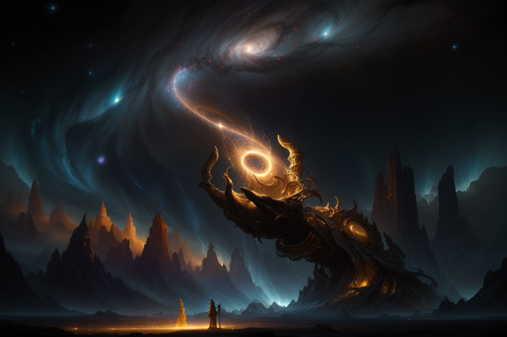

# Project Demiurg



**Project Demiurg** - генеративная система, представляющая собой cемантический движок для создания внутренне непротиворечивых вымышленных реальностей, использующий синтез миров на основе текстовых запросов (промптов) и LLM по модели представления SRGC.

## Обзор

**DEMI** (интрумент **Project Demiurg Engine**) - это инструмент, который преобразует текстовые запросы в **самодостаточные вымышленные реальности**, структурированные по **модели представления SRGC**. Используя мультиагнетную систему на базе локальных **больших языковых моделей (LLM)** через [Ollama](https://ollama.com/), он генерирует семантические [JSON](https://www.json.org) структуры, которые не просто описывают, но и формируют основу для существования и эволюции сложных миров в соответствии с их собственной внутренней логикой, соответствуя принципам **SRGC**.

Независимо от того, создаёте ли вы симуляцию, повествовательную вселенную или абстрактную концептуальную модель, DEMI обеспечивает фундаментальную структуру, основанную на чистом семантическом значении.

---

## Ключевые концепции

Для полного понимания DEMI крайне важно различать сам движок и уникальную модель реальности, которую он использует и генерирует.

### Project Demiurg Engine
**DEMI (Project Demiurg Engine)** - это **генеративная система, движок и инструмент**, который **выполняет процесс генерации, разворачивания (манифестации) и запроса** к мирам. Он принимает запросы пользователя и, используя LLM, создает или модифицирует структуры мира. DEMI - это **механизм**, который позволяет вам взаимодействовать с реальностью.

### SRGC модель представления
**SRGC (Semantic Reality with Gradient Concretization)** - модель представления семантической реальности с градиентной конкретизацией. Это **уникальная концептуальная модель, метафизическая структура или "природа" самой реальности**, которую DEMI генерирует и с которой взаимодействует. В отличие от традиционных, статичных онтологий, SRGC описывает реальность, в которой сущности существуют в **градиентном спектре конкретизации** - от абстрактных концепций и недифференцированных групп до точно проявленных компонентов.

**Ключевая идея SRGC:** Детали мира изначально существуют в состоянии **потенциала и неопределенности**, и они **"материализуются" (проявляются)** по запросу, не нарушая внутреннюю логику мира. Это позволяет миру содержать, например, как **конкретные, полностью проявленные сущности**, так и **неопределенные группы**. SRGC позволяет реальности быть **частично конкретизированной** до момента "наблюдения". Например, "одно яблоко" и "оставшиеся яблоки в корзине" могут корректно сосуществовать в одной SRGC-структуре, где "оставшиеся яблоки" - это сущность с потенциалом дальнейшей конкретизации, а не ошибка

**Мир как синергия:** Мир в DEMI - это **эмерджентная реальность**, которая возникает из синергии между структурированной картой (JSON, созданной моделью SRGC) и языковой моделью (LLM). JSON - это не сам мир, а его **потенциал**, содержащий смыслы и правила. LLM - это не просто генератор текста, а **движок**, который **раскрывает** этот потенциал. Вместе они создают **микро-измерение** - динамическую, логически когерентную систему, которую вы можете исследовать с помощью команд, таких как `navigate` и `query`. Это не статический текст и не воображение, а живая информационная реальность, существующая в процессе взаимодействия.

---

## Интерактивное исследование

Для более интуитивного понимания структурированных выходов DEMI мы предлагаем инструменты для визуализации сгенерированных реальностей.

### Сайт проекта

Для общего обзора DEMI и интегрированного опыта доступен специальный [веб-сайт](https://architector1324.github.io/project-demiurg/index.ru.html) проекта.

### Локальный визуализатор

Интерактивный граф-визуализатор доступен для локального использования, позволяя вам исследовать **структуру градиентной конкретизации** миров DEMI прямо на вашей машине.

*   **Расположение:** Автономный визуализатор находится по адресу [`visualizer/visualizer.ru.html`](./visualizer/visualizer.ru.html) в этом репозитории.
*   **Использование:** Откройте `visualizer.html` в вашем веб-браузере. Вы можете вставить любой сгенерированный DEMI JSON-вывод в текстовое поле или загрузить пример, чтобы увидеть его внутреннюю структуру в виде динамического, разворачивающегося графа.

---

## Первые шаги

### ChatGPT
Если вам интересно узнать об уникальном подходе DEMI к генерации реальности и о том, как он справляется с, казалось бы, невозможными концепциями, такими как бесконечная детализация в конечном файле? Мы записали реальный разговор с **ChatGPT**, который служит доступным введением в ключевые идеи, философию и практические применения DEMI, **особенно в том, как он генерирует реальности и позволяет по ним перемещаться на основе SRGC.**

**Полный текст диалога доступен здесь:** [DEMI: Пояснительный диалог-введение](./ChatGPT/ChatGPT_explanation.ru.md)

### Пример мира

Чтобы лучше понять структуру реальностей, генерируемых **DEMI**, рассмотрим пример простейшего мира - "камня, лежащего на песке". Этот мир создаётся с помощью команды `demi create`, которая принимает краткий текстовый запрос (промпт) и использует LLM (в данном случае `qwen3:4b`) для формирования начальной SRGC-структуры мира.

```bash
demi create 'Очень простая реальность: камень, лежащий на песке' --core qwen3:4b --output world.json
```

Ниже представлен JSON-вывод, который является "чертежом" или **потенциалом** этого новосозданного мира, структурированного согласно модели SRGC. Он содержит пять ключевых измерений, описывающих фундаментальные аспекты реальности:

```json
{
  "discovery": {
    "date": "2025-07-06 15:31:54",
    "core": "qwen3:4b",
    "prompt": "Очень простая реальность: камень, лежащий на песке",
    "seed": 1135929174
  },
  "navigation": {
    "max_depth": 0,
    "history": []
  },
  "world": {
    "essence": "Статическое, физическое расположение камня, покоящегося на гранулированном субстрате, управляемое фундаментальными физическими и экологическими принципами.",
    "primary_constituents": [
      {
        "name": "Камень",
        "description": "Твердый, неорганический объект, состоящий из кристаллических минеральных структур, проявляющий жесткость и сопротивление деформации."
      },
      {
        "name": "Песок",
        "description": "Гранулированный, неорганический материал, состоящий из мельчайших частиц силикатных минералов неправильной формы, характеризующийся низкой когезией и большой площадью поверхности."
      }
    ],
    "governing_framework": [
      "Гравитация как универсальная сила, поддерживающая контакт камня с песком.",
      "Физические свойства камня (плотность, жесткость) и песка (пористость, трение), определяющие стабильность.",
      "Окружающая среда: сухая, земная поверхность с минимальным атмосферным взаимодействием."
    ],
    "driving_forces_and_potential": [
      "Гравитационное притяжение между камнем и подстилающим субстратом песка.",
      "Механическое сцепление между поверхностью камня и частицами песка.",
      "Потенциал для поступательного движения, если внешние силы изменят структуру песка."
    ],
    "foundational_state": "Камень занимает локализованное пространственное положение над непрерывной поверхностью песка, без чистого движения и в равновесии между массой камня и гранулированной опорой песка."
  }
}
```

**Разбор структуры:**

*   **`discovery`**: Метаданные о процессе создания мира – дата, используемая модель LLM (`core`), исходный промпт (`prompt`) и `seed` для воспроизводимости.
*   **`navigation`**: Внутренние данные, используемые DEMI для отслеживания глубины детализации (`max_depth`) и истории "погружений" в мир (`history`). В начальном мире `max_depth` всегда равен `0`.
*   **`world`**: Центральный объект, содержащий семантическое описание реальности. Он состоит из пяти основных полей, которые формируют его основу:
    *   **`essence`**: Фундаментальная природа и концепция этого конкретного мира. Здесь это "статическое, физическое расположение камня на зернистом субстрате".
    *   **`primary_constituents`**: Основные сущности или элементы, из которых состоит мир на этом уровне абстракции. В данном случае это "Камень" и "Песок". Обратите внимание, что они описаны лишь на высоком уровне; их более глубокие детали пока существуют в состоянии потенциала.
    *   **`governing_framework`**: Законы и правила, определяющие функционирование мира и взаимодействие его компонентов. Для "камня на песке" это гравитация, физические свойства материалов и окружающая среда.
    *   **`driving_forces_and_potential`**: Динамические силы, стимулирующие потенциальную эволюцию, изменения или состояния внутри мира. Здесь это силы, удерживающие камень на месте, и потенциал для движения.
    *   **`foundational_state`**: Начальное, равновесное состояние, из которого реальность зарождается. Для нашего мира это "камень занимает локализованное пространственное положение над непрерывной поверхностью песка...".

Этот JSON представляет собой не просто текст, а **самодостаточную, внутренне логичную информационную структуру**, которая ждет "наблюдения" для раскрытия своей бесконечной детализации, как будет показано в разделе [Семантическая навигация](#семантическая-навигация).

## Примеры использования

Исследуйте широкий спектр сгенерированных миров и оцените возможности DEMI в действии, от научно точных систем до вымышленных вселенных и абстрактных концепций.

**Посмотреть полный каталог примеров здесь:** [Каталог Примеров Генерации Миров DEMI (устаревший)](./examples/old/examples.ru.md)

## Мотивация

DEMI родился из стремления исследовать истинные возможности больших языковых моделей за пределами простой беседы или извлечения данных. Он представляет собой **метафизический эксперимент** - поиск способа использовать LLM в качестве семантических движков, способных конструировать самодостаточные, внутренне согласованные реальности, **управляемые SRGC**. 

Цель проекта - продемонстрировать, что даже меньшие, локально запускаемые модели могут служить «семантическим ядром», позволяя создавать и симулировать сложные миры на любом уровне детализации, полностью независимо от внешней человеческой интерпретации, **в соответствии с её принципами**. Этот проект бросает вызов самому понятию того, что составляет «реальность», и как она может быть синтетически сгенерирована **через призму SRGC.**

---

## Ключевые особенности

DEMI предоставляет уникальный набор возможностей для создания и исследования сложных, внутренне согласованных вымышленных реальностей, основанных на модели **SRGC** (Semantic Reality with Gradient Concretization). Вот основные особенности:

### Генерация реальностей по текстовым запросам

- DEMI преобразует короткие текстовые запросы в уникальные, детализированные реальности, полностью адаптированные к вашему видению.
- Каждая реальность формируется в соответствии с принципами SRGC, обеспечивая логическую целостность и глубину.

### Структурированное представление мира

- Реальности представлены в виде **JSON-структур**, которые служат "чертежом" мира, описывая его через пять ключевых измерений:
  - **essence**: Фундаментальная природа и концепция реальности.
  - **primary_constituents**: Основные сущности или элементы, составляющие мир.
  - **governing_framework**: Законы и правила, определяющие функционирование мира.
  - **driving_forces_and_potential**: Динамические силы, стимулирующие эволюцию и изменения.
  - **foundational_state**: Начальное состояние, из которого реальность зарождается.
- Эта структура не просто описывает мир, а задает его внутреннюю логику и потенциал.

### Внутренняя согласованность и универсальность

- DEMI создает **жанрово-независимые** реальности, от квантовой физики до киберпанка, сохраняя их внутреннюю логическую целостность.
- Миры существуют независимо от пользователя, без ориентации на игрока, что отличает DEMI от традиционных игровых или нарративных движков.

### Принцип "Реальность как наблюдение"

- Миры DEMI обладают потенциалом бесконечной детализации, но их детали остаются в состоянии **потенциальности** до момента "наблюдения" через команду `navigate`.
- Вдохновленный квантовой механикой, этот процесс (градиентная конкретизация SRGC) раскрывает детали мира, не нарушая его внутренней логики.
- Пользователь не создает и не изменяет мир, а лишь побуждает его **развернуть** уже существующую семантическую структуру, что обеспечивает абсолютную согласованность.

### Автономность и локальная работа

- DEMI работает полностью локально с использованием Ollama, не требуя подключения к интернету.
- Это обеспечивает автономную, самодостаточную среду для генерации и исследования реальностей.

### Семантическая мощь LLM

- Используемые LLM (например, `qwen3:4b`, `qwen3`) выступают как "семантическое ядро", раскрывая сложность мира через интерпретацию запросов.
- LLM не генерирует произвольный контент, а действует как инструмент, проявляющий внутреннюю логику мира, заданную SRGC.
---

## Установка

Для локального запуска DEMI вам потребуется установленный и настроенный **Ollama**, а также модели `qwen3:4b`/`qwen3`.

1.  **Установите Ollama:** следуйте официальным инструкциям на [ollama.com](https://ollama.com/) для установки Ollama на вашу систему.

2.  **Загрузите модели:**

    ```bash
    ollama pull qwen3:4b
    ollama pull qwen3
    ```

3.  **Клонируйте репозиторий:**

    ```bash
    git clone https://github.com/architector1324/project-demiurg
    ```

4.  **Соберите бинарный файл через скрипт:**

    ```bash
    chmod +x build.sh
    ./build.sh
    ./demi --help
    ```

5. **Установите утилиту** для удобства использования:
    ```bash
    cp ./demi /usr/bin/
    demi --help
    ```

---

## Команды

#### Утилита `demi`

```bash
usage: demi [-h] {create,query,navigate} ...

Semantic engine for generating internally coherent fictional realities - from quantum voids to dreaming cities, using prompt-driven LLM world synthesis.

positional arguments:
  {create,query,navigate}
                        Available commands
    create              Generate a completely new, high-level reality from a short text prompt.
    query               Investigate an existing reality with a specific query.
    navigate            Dive into a specific constituent or subsystem of an existing world and semantically elaborate its details recursively.

options:
  -h, --help            show this help message and exit
```

#### Create

Функция позволяет создать совершенно новую, высокоуровневую реальность из короткого запроса (промпта):

```bash
usage: demi create [-h] [--output OUTPUT] [--core {gemma3n,smollm2,qwen3:4b,qwen3,gemma3}] [--seed SEED] prompt

positional arguments:
  prompt                Short text prompt for reality generation.

options:
  -h, --help            show this help message and exit
  --output, -o OUTPUT   Specify an output file to save the generated reality (e.g., JSON).
  --core, -c {gemma3n,smollm2,qwen3:4b,qwen3,gemma3}
                        Specify the Ollama model to use as semantic core. Available models: gemma3n, smollm2, qwen3:4b, qwen3, gemma3
  --seed, -s SEED       Specify a numerical seed for reproducible reality generation. If not provided, a random seed will be used.
```

#### Navigate

Функция `navigate` позволяет перемещаться и семантически разворачивать присущие, гранулярные детали существующего мира. Это не произвольная генерация; мир автоматически раскрывает свою предсуществующую сложность и структуру при целенаправленном «наблюдении», строго придерживаясь своей внутренней логики:

```bash
usage: demi navigate [-h] [--input INPUT] [--output OUTPUT] [--win WIN] prompt

positional arguments:
  prompt               Prompt to guide the navigation and elaboration.

options:
  -h, --help           show this help message and exit
  --input, -i INPUT    Specify an input file containing an existing reality.
  --output, -o OUTPUT  Specify an output file to save the explored reality (e.g., JSON).
  --win, -w WIN        Specify the maximum context window size (in tokens) for the model during this operation.
```

#### Query

Функция `query` позволяет задавать вопросы сгенерированному миру через семантические вопросы и ответы. Ответы выводятся исключительно из внутренней логики мира - не угадываются или выдумываются:

```bash
usage: demi query [-h] [--input INPUT] [--output OUTPUT] [--think] [--win WIN] prompt

positional arguments:
  prompt               Specific query to investigate the reality.

options:
  -h, --help           show this help message and exit
  --input, -i INPUT    Specify an input file containing an existing reality.
  --output, -o OUTPUT  Specify an output file to save the query results (e.g., Markdown).
  --think, -t          Enable advanced, iterative reasoning for the model to refine outputs. May increase processing time and token usage.
  --win, -w WIN        Specify the maximum context window size (in tokens) for the model during this operation.
```

#### Live

Функция `live` будет симулировать динамическую эволюцию и события внутри сгенерированного мира на основе его внутренних сил и правил. Не реализована, в планах.

---

## Семантическая навигация

Команда `navigate` - это основной инструмент для исследования и раскрытия детализированных слоев сгенерированной реальности, основанной на модели **SRGC** (Semantic Reality with Gradient Concretization). Она реализует принцип **"реальность как наблюдение"**, где детали мира существуют в состоянии потенциальности и проявляются только при целенаправленном запросе, сохраняя внутреннюю логику.

### Как работает навигация
- Пользователь задает точку фокуса (например, "Капля воды") через текстовый запрос.
- LLM, управляемая системным промптом, интерпретирует запрос как **семантическую линзу**, определяя логический путь в структуре мира.
- Команда рекурсивно разворачивает иерархические уровни, добавляя объекты `manifestation` в JSON-структуру мира, раскрывая детали в соответствии с SRGC.

### Принцип "Реальность как наблюдение"
- Детали мира изначально находятся в состоянии **потенциальности**, подобно квантовой механике, и "материализуются" только при "наблюдении" через `navigate`.
- Пользователь не создает новую реальность, а лишь побуждает мир раскрыть уже существующую сложность, строго следуя его внутренней логике.
- Это обеспечивает полную **внутреннюю согласованность**, так как LLM действует как "раскрыватель" семантической структуры, а не произвольный генератор.

### Ключевые особенности
- **Иерархическая согласованность**: Каждый объект `manifestation` включает собственные `essence`, `primary_constituents`, `governing_framework`, `driving_forces_and_potential` и `foundational_state`, которые логически вытекают из родительской сущности и общих законов мира.
- **Семантическое разворачивание**: LLM интерпретирует запрос, находя путь к запрошенной сущности. Например, запрос "Женщина за столом в ресторане" в мире, описанном до "Нью-Йорк", разворачивает цепочку: `Город -> Район -> Здание -> Ресторан -> Стол -> Женщина`.
- **Фокусированная детализация**: Для крупных сущностей DEMI выделяет ключевые подкомпоненты, объединяя остальные в обобщенные сущности (например, "Другие компоненты"), чтобы избежать избыточных данных.
- **Внутренняя логика**: Вывод описывает мир изнутри, без внешней перспективы, подчеркивая независимость реальности от наблюдателя.

### Результат
- Команда возвращает обновленный JSON мира, где указанная сущность дополняется новым уровнем детализации.
- Это позволяет рекурсивно исследовать реальность, создавая все более подробную **SRGC-структурированную карту**.

### Пример

Давайте рассмотрим, как команда `navigate` постепенно раскрывает детали мира, демонстрируя принцип **"реальность как наблюдение"**.

#### Создание мира

Сначала создадим базовый мир, используя команду `demi create`:

```bash
demi create 'Очень простая реальность: камень, лежащий на песке' --core qwen3 --output world.json
```

На этом этапе `world.json` будет содержать высокоуровневое описание мира. Обратите внимание на структуру пяти ключевых измерений (`essence`, `primary_constituents`, `governing_framework`, `driving_forces_and_potential`, `foundational_state`):

```json
{
  "discovery": {
    "date": "2025-06-26 21:46:22",
    "core": "qwen3",
    "prompt": "Очень простая реальность: камень, лежащий на песке",
    "seed": ... /* ... */
  },
  "navigation": {
    "max_depth": 0,
    "history": []
  },
  "world": {
    "essence": "Минималистичная физическая система, где твердый объект находится в статическом равновесии на гранулированной среде.",
    "primary_constituents": [
      {
        "name": "камень",
        "description": "Дискретная, жесткая, нежидкая масса, характеризующаяся сопротивлением деформации и гравитационной инерцией."
      },
      {
        "name": "песок",
        "description": "Гранулированный, полужидкий агрегат, состоящий из бесчисленных мельчайших частиц неправильной формы, находящихся в непрерывном динамическом взаимодействии."
      }
    ],
    "governing_framework": [
      "Гравитационное притяжение между массой и локальным пространственным полем",
      "Механическая устойчивость дискретных объектов в гранулированной среде",
      "Тепловое равновесие между макроскопическими и микроскопическими компонентами"
    ],
    "driving_forces_and_potential": [
      "Градиент гравитационной потенциальной энергии, поддерживающий положение камня",
      "Межгранулярные силы трения, стабилизирующие структуру песка",
      "Тепловое движение частиц в песчаной среде"
    ],
    "foundational_state": "Камень занимает устойчивое равновесное положение в песчаной матрице, без чистого движения или передачи энергии между составляющими."
  }
}
```

Это начальное, "непроявленное" состояние мира, где детали существуют лишь в потенциале. `max_depth` равен 0, так как мы еще не углублялись.*

#### Углубляемся в Камень

Теперь попросим DEMI "проявить" детали сущности "Камень" внутри текущего мира:

```bash
demi navigate 'Камень' --input world.json --output world.json
```

После этой команды `world.json` обновится. Обратите внимание, как к объекту `"Stone"` был добавлен новый блок `"manifestation"`, содержащий его детальное описание по той же SRGC-модели.

```json
{
  "discovery": { /* ... информация о создании мира */ },
  "navigation": {
    "max_depth": 1, // Глубина увеличилась
    "history": [
      // Добавлена история навигации
      {
        "date": "2025-06-26 21:51:31",
        "prompt": "камень"
      }
    ]
  },
  "world": {
    "essence": "Минималистичная физическая система, где твердый объект находится в статическом равновесии на гранулированной среде.", /* ... исходное описание мира */
    "primary_constituents": [
      {
        "name": "камень",
        "description": "Дискретная, жесткая, нежидкая масса, характеризующаяся сопротивлением деформации и гравитационной инерцией.",
        "manifestation": { // НОВЫЙ БЛОК: Детализация "камня"
          "essence": "Макроскопическая, жесткая, нежидкая масса, состоящая из агрегированных минеральных частиц, проявляющих структурную когезию и сопротивление деформации.",
          "primary_constituents": [
            {
              "name": "Кварцевый Кристалл",
              "description": "Репрезентативный минералогический компонент, характеризующийся тетраэдрической атомной структурой и изотропными механическими свойствами."
            },
            {
              "name": "Остальные Минеральные Частицы",
              "description": "Совокупный агрегат силикатных и металлических минеральных фрагментов, образующий основную массу макроструктуры камня через взаимосвязанные кристаллические решетки."
            }
          ],
          "governing_framework": [
            "Когезионная связь между узлами минеральной решетки",
            "Распределение структурных напряжений по кристаллическим границам",
            "Анизотропия термического расширения составляющих минералов"
          ],
          "driving_forces_and_potential": [
            "Резонанс кристаллической решетки, поддерживающий структурную целостность",
            "Межфазные силы трения, препятствующие внешнему смещению",
            "Потенциал термически индуцированного распространения микротрещин"
          ],
          "foundational_state": "Поликристаллическая матрица, содержащая 78% кварца, 15% полевого шпата и 7% слюды по объему, демонстрирующая распределение сжимающих напряжений 0.3 МПа по границам зерен при 25°C."
        }
      },
      {
        "name": "песок",
        "description": "Гранулированный, полужидкий агрегат, состоящий из бесчисленных мельчайших частиц неправильной формы, находящихся в непрерывном динамическом взаимодействии."
      }
    ],
    "governing_framework": [ /* ... законы мира */ ],
    "driving_forces_and_potential": [ /* ... движущие силы мира */ ],
    "foundational_state": "Камень занимает устойчивое равновесное положение..." /* ... */
  }
}
```

Мы "наблюдали" камень, и мир раскрыл его внутреннюю структуру, добавив детализированный `manifestation` блок. `max_depth` увеличился до 1, а `history` отслеживает наш путь. Обратите внимание, что `primary_constituents` внутри `manifestation` "камня" теперь описывают его составляющие, такие как "Quartz Crystal".*

#### Углубляемся в Песок

Аналогично, раскроем детали сущности "Песок". Это происходит в том же файле `world.json`, дополняя его:

```bash
demi navigate 'Песок' --input world.json --output world.json
```

Теперь объект `"sand"` также содержит блок `"manifestation"`. Уже проявленные детали "камня" (и его `manifestation`) остаются неизменными.

```json
{
  "discovery": { /* ... */ },
  "navigation": {
    "max_depth": 1, // Глубина остается прежней, так как это параллельная ветвь на первом уровне
    "history": [
      { "date": "2025-06-26 21:51:31", "prompt": "камень" },
      { "date": "2025-06-26 22:05:43", "prompt": "песок" } // Добавлена новая запись в историю
    ]
  },
  "world": {
    "essence": "Минималистичная физическая система...", /* ... */
    "primary_constituents": [
      {
        "name": "камень",
        "description": "Дискретная, жесткая, нежидкая масса...",
        "manifestation": { /* ... полный блок manifestation для "камня" из предыдущего шага */ }
      },
      {
        "name": "песок",
        "description": "Гранулированный, полужидкий агрегат, состоящий из бесчисленных мельчайших частиц неправильной формы, находящихся в непрерывном динамическом взаимодействии.",
        "manifestation": { // НОВЫЙ БЛОК: Детализация "песка"
          "essence": "Полужидкий, динамически взаимодействующий агрегат мельчайших частиц неправильной формы, проявляющий коллективное поведение через межгранулярные силы и непрерывное микромасштабное движение.",
          "primary_constituents": [
            {
              "name": "Гранулированная Частица",
              "description": "Репрезентативная мельчайшая единица неправильной формы, характеризующаяся переменным распределением размеров, угловатостью и шероховатостью поверхности, способная к независимому движению внутри агрегата."
            },
            {
              "name": "Общий Гранулированный Агрегат",
              "description": "Коллективное состояние взаимосвязанных, непрерывно взаимодействующих частиц, образующих временную, полужидкую среду с эмерджентными свойствами, возникающими из взаимодействий на уровне частиц."
            }
          ],
          "governing_framework": [
            "Межгранулярная фрикционная когезия, поддерживающая структурную целостность",
            "Динамическая перестройка частиц под воздействием приложенного напряжения",
            "Термически обусловленное броуновское микромасштабное движение"
          ],
          "driving_forces_and_potential": [
            "Рассеяние энергии за счет межчастичного трения",
            "Потенциал разжижения, вызванный градиентом порового давления",
            "Динамика смещения частиц, активируемая теплом"
          ],
          "foundational_state": "Полидисперсная гранулированная матрица с 63% частиц в диапазоне размеров 0.1-0.5 мм, 28% в диапазоне 0.05-0.1 мм и 9% мелкой пыли, демонстрирующая эффективное напряжение 125 Па и коэффициент пустотности 0.85 при 20°C."
        }
      }
    ],
    "governing_framework": [ /* ... */ ],
    "driving_forces_and_potential": [ /* ... */ ],
    "foundational_state": "Камень занимает устойчивое равновесное положение..." /* ... */
  }
}
```

Мы продолжаем раскрывать мир, добавляя детализированную структуру для "песка" рядом с уже существующей структурой "камня". Оба объекта теперь имеют свои `manifestation` блоки на первом уровне детализации.*

#### Углубляемся в Кварцевый Кристалл (внутри Камня)

Пойдем еще глубже, сфокусировавшись на "Кварцевый Кристалл", который является частью "Камня". Команда `navigate` способна найти эту вложенную сущность:

```bash
demi navigate 'Кварцевый Кристалл' --input world.json --output world.json
```

JSON-структура мира теперь будет содержать новый, вложенный блок `"manifestation"` для "Кварцевый Кристалл" внутри `manifestation` "камня":

```json
{
  "discovery": { /* ... */ },
  "navigation": {
    "max_depth": 2, // Глубина увеличилась, так как мы погрузились на новый уровень
    "history": [
      { "date": "2025-06-26 21:51:31", "prompt": "камень" },
      { "date": "2025-06-26 22:05:43", "prompt": "песок" },
      { "date": "2025-07-04 23:36:03", "prompt": "Кварцевый Кристалл" } // Добавлена новая запись в историю
    ]
  },
  "world": {
    "essence": "Минималистичная физическая система...", /* ... */
    "primary_constituents": [
      {
        "name": "камень",
        "description": "Дискретная, жесткая, нежидкая масса...",
        "manifestation": {
          "essence": "Макроскопическая, жесткая, нежидкая масса...", /* ... */
          "primary_constituents": [
            {
              "name": "Кварцевый Кристалл",
              "description": "Репрезентативный минералогический компонент, характеризующийся тетраэдрической атомной структурой и изотропными механическими свойствами.",
              "manifestation": { // НОВЫЙ ВЛОЖЕННЫЙ БЛОК: Детализация "кварцевого кристалла"
                "essence": "Фундаментальный минералогический компонент, характеризующийся тетраэдрической атомной структурой и изотропными механическими свойствами.",
                "primary_constituents": [
                  {
                    "name": "Атомная Решетка",
                    "description": "Трехмерное расположение атомов кремния и кислорода, образующее повторяющуюся тетраэдрическую сеть, где каждый атом кремния связан с четырьмя атомами кислорода."
                  },
                  {
                    "name": "Остальные Атомные Взаимодействия",
                    "description": "Коллективное состояние колебательных и электростатических взаимодействий между атомами решетки, поддерживающее структурную целостность и обеспечивающее распространение энергии."
                  }
                ],
                "governing_framework": [
                  "Ковалентная связь между атомами кремния и кислорода",
                  "Распространение фононов через кристаллическую решетку",
                  "Поведение тетраэдрической сети при тепловом расширении"
                ],
                "driving_forces_and_potential": [
                  "Энергия колебаний решетки, поддерживающая атомные позиции",
                  "Электростатические взаимодействия, стабилизирующие тетраэдрические связи",
                  "Потенциал термически индуцированного распространения фононов"
                ],
                "foundational_state": "Идеальная кремниево-кислородная тетраэдрическая решетка со 100% ковалентной связью, демонстрирующая энергию диссоциации связи 1.1 эВ и модуль податливости 5.7×10^-11 Па при 0 К."
              }
            },
            {
              "name": "Остальные Минеральные Частицы",
              "description": "Совокупный агрегат силикатных и металлических минеральных фрагментов, образующий основную массу макроструктуры камня через взаимосвязанные кристаллические решетки."
            }
          ],
          "governing_framework": [ /* ... */ ],
          "driving_forces_and_potential": [ /* ... */ ],
          "foundational_state": "Поликристаллическая матрица..."
        }
      },
      {
        "name": "песок",
        "description": "Гранулированный, полужидкий агрегат...",
        "manifestation": { /* ... полный блок manifestation для "песка" из предыдущего шага */ }
      }
    ],
    "governing_framework": [ /* ... */ ],
    "driving_forces_and_potential": [ /* ... */ ],
    "foundational_state": "Камень занимает устойчивое равновесное положение..."
  }
}
```

DEMI корректно нашел "Кварцевый Кристалл" внутри уже "проявленного" камня и раскрыл его до атомарного уровня, демонстрируя иерархическое углубление и неизменность внутренней логики мира. Теперь `max_depth` достиг 2.

#### Итог

Этот пример наглядно демонстрирует ключевые принципы работы **DEMI** и модели **SRGC**. Он показывает, как команда `navigate` не просто создает новые детали, а выступает в роли **"семантической линзы"**, которая **раскрывает** уже существующую, потенциальную сложность мира. Каждое углубление, подобно акту "наблюдения", конкретизирует фрагмент реальности, добавляя новые слои `manifestation` и обеспечивая при этом полную внутреннюю иерархическую согласованность от высокоуровневых концепций до мельчайших составляющих. Это подчеркивает роль **LLM** как **семантического ядра**, который проявляет, а не произвольно генерирует, структуры мира.

---

## Манифест: видение, лежащее в основе Project Demiurg

DEMI - это больше, чем просто генератор миров; это **движок для создания автономных, живых, самодостаточных реальностей**, **структурированных по SRGC**. Эти миры существуют по своим собственным внутренним законам, не ради игрока или наблюдателя.

*   **Семантическое ядро:** Мы используем язык, чтобы ковать миниатюрные вселенные, при этом LLM служит их дыханием.
*   **SRGC, а не Онтология:** Это не просто текст; это **SRGC-структурированная реальность** - упорядоченная совокупность сущностей, их взаимосвязей, законов и движущих сил.
*   **Свидетель, а не автор:** Вы не автор, игрок или бог; вы **свидетель инородной реальности**, наблюдающий миры, где события разворачиваются по своим внутренним причинам, не для нас и не из-за нас, **как это диктуется SRGC.**
*   **LLM как Закон:** Мир живёт сам по себе. LLM выступает в роли **физического закона, управляющего его существованием**, **проявляя свою структуру в соответствии с SRGC.**
*   **Вызов реальности:** Это **метафизический эксперимент в карманном формате**, разработанный для того, чтобы раскрыть истинные возможности языковых моделей - даже небольших - и раздвинуть границы того, что составляет «реальность» **через призму SRGC.**
